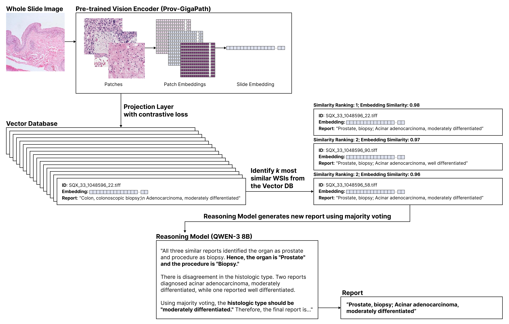

# 병리 슬라이드 RAG 모델
병리 슬라이드 이미지에서 자동으로 의료 보고서를 생성하는 Retrieval Augmented Generation (RAG) 모델입니다.

## 모델 개요

RAG 모델은 두 가지 핵심 단계로 구성됩니다: Retrieval과 Generation.

### Retrieval 단계
병리학 특화 파운데이션 모델 [paige-ai/Virchow2](https://huggingface.co/paige-ai/Virchow2)을 사용하여 슬라이드 이미지에서 의미 있는 특징을 추출합니다. 파운데이션 모델에서 추출된 원본 벡터는 서로 다른 병리 소견 간의 구분이 명확하지 않기 때문에, 대조 학습(contrastive learning)을 통해 추가적인 투사층(projection layer)을 학습합니다.

이 투사층은 다음과 같이 작동합니다:

- 동일한 의료 보고서에 해당하는 이미지들의 벡터는 서로 가깝게 투영
- 서로 다른 보고서에 해당하는 이미지들의 벡터는 멀리 투영

학습된 투사층을 통해 변환된 벡터들은 Vector Database에 저장되어, 새로운 슬라이드 이미지가 입력될 때 유사한 사례들을 효과적으로 검색할 수 있도록 합니다.

### Generation 단계
새로운 병리 이미지가 입력되면 다음 과정을 거쳐 보고서를 생성합니다:

1. 특징 추출: 파운데이션 모델과 학습된 투사층을 통해 입력 이미지의 특징 벡터를 추출
2. 유사 사례 검색: Vector Database에서 가장 유사한 벡터들을 검색하여 관련 의료 보고서들을 검색
3.보고서 생성: 검색된 유사 보고서들을 참조하여 [Qwen/Qwen3-8B](https://huggingface.co/Qwen/Qwen3-8B) 추론 모델이 새로운 의료 보고서를 작성

이러한 두 단계의 결합을 통해 병리학적 정확성과 일관성을 갖춘 자동 의료 보고서 생성이 가능합니다.

## 참가 대회
- [REG 2025](https://reg2025.grand-challenge.org/)
